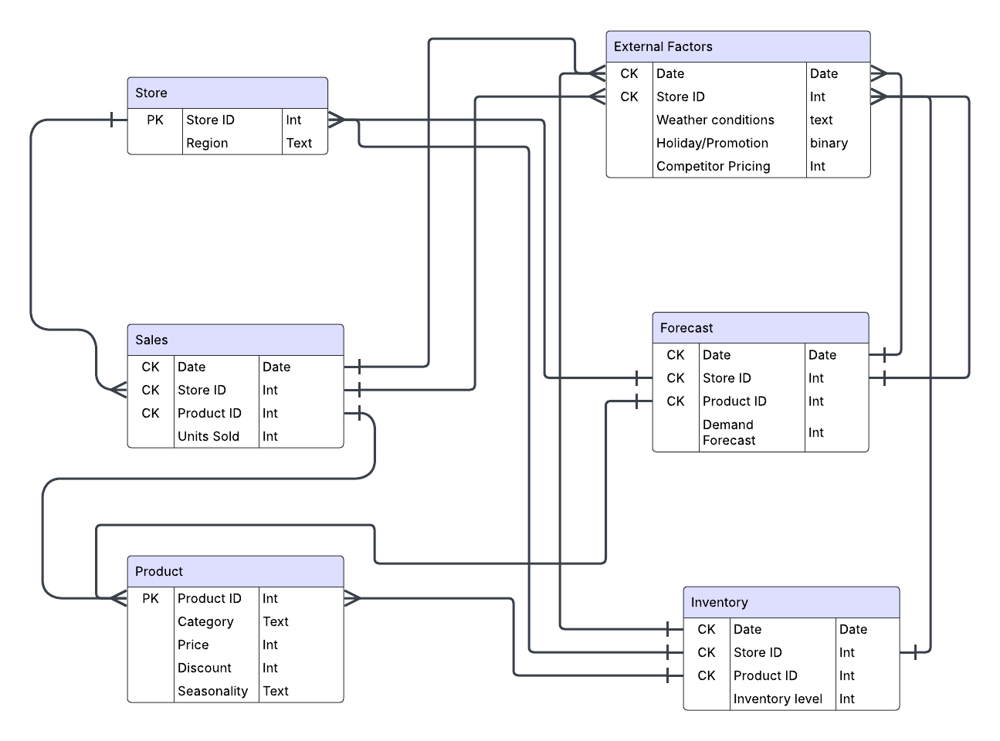

## Solving Inventory Inefficiencies Using SQL

This project focuses on diagnosing and optimizing inventory performance for **Urban Retail Co.**, which manages over 5,000 SKUs across multiple store locations. We used **advanced SQL analytics** to identify inefficiencies, predict stock issues, analyze sales trends, and recommend improvements—ultimately enabling smarter inventory decisions.

---

### Project Structure

* **Data Loading**: Structured ERD with relational normalization.
* **SQL Analytics**: Over 15 SQL queries used to derive actionable insights.
* **Visualization**: Google Looker Studio dashboard.
* **Recommendations**: Data-driven inventory strategies for optimization.
* **Business Impact**: Reduced stockouts, improved turnover, better forecasting.

---

### Key SQL Components

* **Stock Level Calculation**
  `SUM`, `GROUP BY`, and filters to calculate stock by SKU/store.

* **Top-Selling Products**
  Ordered sales data to find fast-moving items for prioritization.

* **Low Inventory Detection**
  `WHERE Inventory_Level < threshold` to flag stockout risks.

* **Reorder Point Estimation**
  Rolling average using `OVER(...)` for dynamic thresholding.

* **Inventory Turnover**
  `SUM(Units_Sold) / AVG(Inventory_Level)` to analyze efficiency.

* **Forecast Accuracy**
  `ABS(Units_Sold - Forecast)` to flag bad forecasting.

* **Revenue Leakage Detection**
  Filters for `Inventory = 0 AND Forecast > 0` to estimate loss.

---

### Key Insights

* P0016, P0057, P0125 → Top-selling SKUs
* P0149 at S002 → ₹224 lost due to stockout
* 1,200+ day overstock detected on low-demand items
* Weekend and seasonal spikes (Jan, Mar, May)
* Forecasting gaps identified at store level

---

### Recommendations

1. Replenish high-demand SKUs dynamically
2. Reduce overstocking via SKU age and clearance
3. Improve forecast buffers
4. Automate reorder logic in ERP
5. Monitor suppliers using SLA-like metrics
6. Use weather trends to refine demand forecasting

---

### Business Impact

* 30–50% stockout reduction (estimated)
* 20–40% warehouse optimization
* Better forecasting and seasonal preparation
* Early SKU performance insights

---

### ABC Analysis

* P0066, P0061, P0133 → Top revenue contributors
* C-class SKUs to be discounted or bundled

---

### Supplier Performance Metrics

* **Inferred Lead Time** via `LEAD()` and date comparisons
* **Fulfillment Status** from `Units Ordered` vs Inventory Received

---

## Files

* `SQL Queries/`: Raw query scripts
* `Dashboard/`: Screenshots and Looker Studio link

